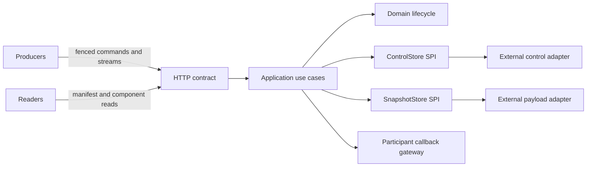

# Version Gate

Version Gate is the core coordination module for publishing a set of immutable,
client-produced snapshot components as one visible version.

It solves a narrow problem: readers must not observe a half-refreshed data set
while producers replace several related payloads. Producers build a candidate
version behind a fenced lease; the candidate becomes publicly readable only
after it is complete and its active-version pointer is atomically changed.

## Repository status and scope

This repository deliberately contains:

- the domain model and lifecycle rules;
- application use cases;
- the public `ControlStore`, `SnapshotStore`, and participant gateway SPIs;
- the HTTP API, error, callback-protocol, and OpenAPI contracts; and
- Spring configuration for composing those pieces.

It deliberately contains **no production storage implementation**. In
particular, there is no retained JDBC, database-vendor, object-storage SDK,
migration, local emulator, container stack, or storage integration-test code.
The core is not a runnable production service by itself.

A deployable distribution must depend on this core, supply exactly one
`ControlStore` bean and one `SnapshotStore` bean, and configure the participant
gateway. Storage adapters should live in independent repositories so their
drivers, migrations, release cadence, and operational policy do not leak into
the core.

The anticipated repositories `version-gate-storage-postgres` and
`version-gate-storage-s3` are names for separately versioned adapter projects,
not implementations shipped here. PostgreSQL and S3 are non-binding future
examples; any technology can implement the public SPI if it satisfies the
semantic contract in [Architecture and consistency](docs/architecture.md).
An adapter repository depends on a released version of this core for the port
interfaces and domain value types; the core never depends on an adapter.

## Why immutable versions?

Updating a cache or materialized data set in place creates an interval in which
readers can observe a mixture of old and new values. Version Gate instead gives
every refresh a distinct version:

1. create a `BUILDING` candidate and fenced lease;
2. capture and upload immutable components;
3. verify that the required version is complete;
4. finalize its immutable manifest as `READY`; and
5. compare-and-set the resource's active pointer and mark the build `ACTIVE`.

Only step 5 makes the version public. A failed upload, expired lease, process
restart, or unsuccessful activation leaves the previous version readable.

`beginBuild` is version-oriented concurrency control, not a generic distributed
lock. Each resource has at most one non-terminal build, and every mutating build
operation presents the current fencing token.

## Snapshot policies

| Policy | Consistency responsibility |
| --- | --- |
| `CLIENT_MANAGED` | The client decides when and how to capture an acceptable state. Version Gate validates ownership, immutability, and completeness before activation. |
| `COORDINATED_QUIESCE` | Version Gate asks registered participants to quiesce, capture, and resume through HTTP callbacks. Participants still perform write protection and snapshot production. |

`COORDINATED_QUIESCE` is cooperative. Version Gate cannot stop writes in a
participant's database or prove that a participant obeyed the request. See
[the coordinated-quiesce protocol](docs/coordinated-quiesce.md).

Component bodies are opaque streams. Version Gate does not interpret, join,
merge, restore, or business-validate them.

## Model and lifecycle

- A **resource** names a logical data set, its policy, required component IDs,
  and current active version.
- A **build** owns one candidate version, a lease, and a monotonically fenced
  token.
- A **snapshot component** is an immutable payload plus its key, SHA-256, media
  type, byte length, capture time, and optional encoding/schema metadata.
- A **version manifest** describes one complete version and all required
  components.

```text
CLIENT_MANAGED:
  BUILDING -> SNAPSHOTTING -> READY -> ACTIVE

COORDINATED_QUIESCE:
  BUILDING -> QUIESCING -> SNAPSHOTTING -> READY -> ACTIVE

Any non-terminal state -> FAILED or ABANDONED
```

`QUIESCING` is valid only for `COORDINATED_QUIESCE`. `FAILED`, `ABANDONED`, and
`ACTIVE` are terminal. Active manifests and their component identities are
immutable.

## Architecture



The core has no dependency on a concrete storage driver:

```text
io.github.kbarseghyan.versiongate
├── api
├── domain
├── application
├── port
│   ├── ControlStore
│   ├── SnapshotStore
│   └── ParticipantGateway
├── adapter
│   └── http
└── configuration
```

An adapter is not correct merely because it implements the Java methods. It
must preserve the SPI's transactional and failure semantics:

- one atomic non-terminal build per resource;
- an adapter-authoritative lease clock read after the relevant lock;
- atomic fence, lease, and lifecycle-transition checks;
- compare-and-set activation against `baseActiveVersion`;
- no manifest/component visibility through public lookups before activation;
- immutable, bounded-memory payload writes and reads;
- full object key, byte-length, and SHA-256 verification rather than trust in
  provider metadata alone; and
- stable conflict, missing-object, corruption, crash, and retry behavior.

See [Architecture and consistency](docs/architecture.md) before implementing or
selecting an adapter.

## Composing a runnable distribution

Spring Boot auto-configuration constructs the use cases, scheduler, HTTP API,
and participant callback gateway from the public ports; composition does not
depend on the consuming application's component-scan package. A distribution
supplies storage beans in its own configuration:

```java
@Configuration(proxyBeanMethods = false)
class DistributionStorageConfiguration {

  @Bean
  ControlStore controlStore(/* adapter-specific dependencies */) {
    return /* a contract-compliant implementation */;
  }

  @Bean
  SnapshotStore snapshotStore(/* adapter-specific dependencies */) {
    return /* a contract-compliant implementation */;
  }
}
```

The distribution should package its own application entry point (or invoke the
optional core bootstrap with the adapter artifacts on its classpath), and own adapter
credentials, migrations, health checks, backup, retention, and deployment
configuration. Starting this repository without those beans is expected to fail
fast instead of silently using an in-memory or unsafe fallback.

Core configuration keys are illustrated in
[config/application-local.example.yml](config/application-local.example.yml).
They do not configure a backing store. A composed distribution may add its own
adapter-specific namespace.

Coordinated callback fan-out defaults to eight participants per resource and
can be configured only up to the domain hard limit of 32. V1 issues bounded,
synchronous callback requests; operators should keep the participant count and
request timeout conservative for their ingress timeout budget.

When a composed distribution is running, it exposes:

- liveness/readiness according to that distribution's health policy;
- OpenAPI JSON at `/v3/api-docs`; and
- Swagger UI at `/swagger-ui.html`.

## API workflow for a composed distribution

The following `CLIENT_MANAGED` example assumes a correctly composed distribution
is already listening at `http://localhost:8080`. The core repository does not
provide the storage adapters needed to start that process.

```bash
set -euo pipefail

API=http://localhost:8080
RESOURCE=catalog

curl --fail-with-body --silent --show-error \
  -X POST "$API/resources" \
  -H 'Content-Type: application/json' \
  -d '{
    "resourceId": "catalog",
    "snapshotPolicy": "CLIENT_MANAGED",
    "requiredComponentIds": ["products", "prices"]
  }' | jq .

BUILD_JSON="$(
  curl --fail-with-body --silent --show-error \
    -X POST "$API/resources/$RESOURCE/builds" \
    -H 'Content-Type: application/json' \
    -d '{
      "targetVersion": 1,
      "owner": "catalog-publisher",
      "leaseSeconds": 300
    }'
)"

BUILD_ID="$(printf '%s' "$BUILD_JSON" | jq -r .buildId)"
FENCING_TOKEN="$(printf '%s' "$BUILD_JSON" | jq -r .fencingToken)"

curl --fail-with-body --silent --show-error \
  -X POST "$API/builds/$BUILD_ID/snapshot" \
  -H "X-Fencing-Token: $FENCING_TOKEN" | jq .

printf '%s\n' \
  '{"id":"p-1","name":"Coffee"}' \
  '{"id":"p-2","name":"Tea"}' >/tmp/version-gate-products.ndjson
printf '%s\n' \
  '{"productId":"p-1","amount":"12.50","currency":"USD"}' \
  '{"productId":"p-2","amount":"8.25","currency":"USD"}' \
  >/tmp/version-gate-prices.ndjson

PRODUCTS_SHA="$(
  openssl dgst -sha256 -r /tmp/version-gate-products.ndjson | awk '{print $1}'
)"
PRICES_SHA="$(
  openssl dgst -sha256 -r /tmp/version-gate-prices.ndjson | awk '{print $1}'
)"

curl --fail-with-body --silent --show-error \
  -X PUT "$API/builds/$BUILD_ID/components/products" \
  -H "X-Fencing-Token: $FENCING_TOKEN" \
  -H "X-Checksum-SHA256: $PRODUCTS_SHA" \
  -H 'Content-Type: application/x-ndjson' \
  -H 'X-Schema-Version: catalog-products/1' \
  --data-binary @/tmp/version-gate-products.ndjson | jq .

curl --fail-with-body --silent --show-error \
  -X PUT "$API/builds/$BUILD_ID/components/prices" \
  -H "X-Fencing-Token: $FENCING_TOKEN" \
  -H "X-Checksum-SHA256: $PRICES_SHA" \
  -H 'Content-Type: application/x-ndjson' \
  -H 'X-Schema-Version: catalog-prices/1' \
  --data-binary @/tmp/version-gate-prices.ndjson | jq .

curl --fail-with-body --silent --show-error \
  -X POST "$API/builds/$BUILD_ID/complete" \
  -H "X-Fencing-Token: $FENCING_TOKEN" | jq .

curl --fail-with-body --silent --show-error \
  -X POST "$API/builds/$BUILD_ID/activate" \
  -H "X-Fencing-Token: $FENCING_TOKEN" | jq .

curl --fail-with-body --silent --show-error \
  "$API/resources/$RESOURCE/versions/active/manifest" | jq .

curl --fail-with-body --silent --show-error \
  "$API/resources/$RESOURCE/versions/1/components/products"
```

Uploads require `Content-Length`; `curl --data-binary @file` supplies it for a
regular file. Supported media types are `application/json`,
`application/x-ndjson`, and `application/octet-stream`.
`X-Checksum-SHA256` is optional but recommended. The hash covers the exact
transmitted bytes, including any content encoding.

Submitting an existing component with the same identity and SHA-256 returns its
stable prior result. Reusing that identity with different content returns
`409 Conflict`; bytes and metadata must never be overwritten.

Lease renewal uses the same fence:

```bash
curl --fail-with-body --silent --show-error \
  -X POST "$API/builds/$BUILD_ID/renew" \
  -H "X-Fencing-Token: $FENCING_TOKEN" \
  -H 'Content-Type: application/json' \
  -d '{"leaseSeconds":300}' | jq .
```

For `COORDINATED_QUIESCE`, renewal is permitted only while the build remains
`BUILDING`; changing the lease after quiescence would change an idempotent
callback body.

## HTTP and retry semantics

State-changing build requests require `X-Fencing-Token`. A token identifies an
ownership generation, not an authentication credential.

V1 uses operation-specific idempotency:

- same-content component retries return the prior component;
- completion and activation retries return their prior successful result; and
- after an ambiguous `beginBuild` timeout, a client queries the resource's
  current build before deciding whether to begin again.

Errors use `application/problem+json` with stable `type`, `title`, `status`,
`detail`, `instance`, and `code` fields.

| Status | Meaning |
| --- | --- |
| `400 Bad Request` | Malformed or invalid input |
| `404 Not Found` | Requested resource, build, active version, or component is absent |
| `409 Conflict` | Concurrent build, expired lease, immutable-content conflict, or invalid transition |
| `412 Precondition Failed` | Wrong or stale fencing token |
| `415 Unsupported Media Type` | Unsupported component media type |
| `422 Unprocessable Content` | Body checksum or resource/component requirements do not match |
| `502 Bad Gateway` | Coordinated participant callback failed |
| `503 Service Unavailable` | A configured adapter is unavailable or reports inconsistent storage |

## Failure guarantees

Version Gate does not claim one transaction across the control and payload
ports. The ordered protocol is:

```text
write and verify an immutable payload
register component metadata
finalize an immutable READY manifest
atomically compare-and-set the active pointer
```

A correct adapter composition guarantees:

- the previous active version remains public until activation commits;
- failed or abandoned builds never move the active pointer;
- stored lifecycle state survives coordinator process restarts;
- stale fencing tokens cannot mutate a later ownership generation;
- an orphan payload may remain after metadata failure but is not public;
- missing or corrupt payloads fail closed;
- activation conflict changes neither the pointer nor candidate visibility; and
- cleanup never deletes payloads referenced by an active manifest.

V1 has no durable callback or orphan-cleanup reconciliation worker. Recovery
after an ambiguous crash may require an explicit client/operator retry. Adapter
documentation must describe any stronger reconciliation it provides.

## Operational limitations

V1 intentionally has:

- one candidate build per resource and no multi-resource atomic activation;
- no concrete production storage adapter in this repository;
- no snapshot merging, business-schema validation, or restoration;
- no messaging system, event sourcing, Java client SDK, or generic lock API;
- no proof that coordinated participants stopped writes;
- no built-in end-user authentication or TLS termination; and
- no performance or capacity claim without adapter-specific benchmarks.

## Build and test

Requirements are JDK 21 and a POSIX-like shell. The Maven Wrapper pins Maven:

```bash
./mvnw verify
```

Core tests use fakes/mocks at the public ports and require no container runtime.
Concrete adapter repositories are responsible for their own compatibility,
concurrency, failure-injection, migration, and integration tests.

See [CONTRIBUTING.md](CONTRIBUTING.md) for change expectations.

## License

Version Gate is licensed under the [Apache License 2.0](LICENSE).
