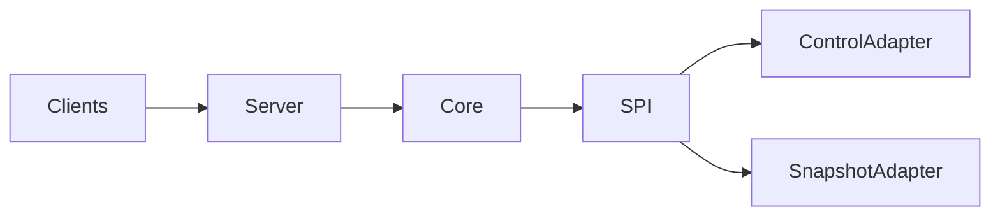

# Architecture and consistency

## Scope

Version Gate publishes a set of immutable, client-produced snapshot components
as one resource version. It coordinates publication; it does not understand the
payloads or provide a distributed transaction across their producers.

The core safety property is:

> A reader resolving the active version observes either the previous complete
> manifest or the next complete manifest, never a partially activated manifest.

This property applies to the Version Gate metadata pointer. It does not imply
that independently captured payloads represent one business transaction.

## Module and adapter boundary



The root is the Maven aggregator for one standalone service product. Its Maven
modules are internal responsibility and dependency boundaries, not separately
published Java libraries. The final deployable product is the executable
`version-gate-server` distribution. `version-gate-spi` owns domain values,
stable errors, and infrastructure ports without framework dependencies.
`version-gate-core` owns lifecycle and use cases and depends only on the SPI and
JDK. Official adapters live beside them as sibling internal modules.
`version-gate-server` owns HTTP, OpenAPI, callbacks, scheduling, bootstrap, and
the explicit selection of adapter modules included in its executable JAR.
`version-gate-testkit` supplies reusable semantic contract tests.

The current PostgreSQL-control and S3-snapshot modules are placeholders: they
establish the official boundaries but intentionally contain no concrete
drivers, SDKs, migrations, or storage beans yet. Missing beans remain a
composition error and fail startup. Future adapter modules own their driver
configuration, credentials, migrations, health checks, backup, retention, and
operational documentation.

Framework, driver, query-language, and provider SDK types must not cross the
ports. An adapter may strengthen durability or observability but must not weaken
the public semantics.

The architectural rule is:

```text
SPI defines guarantees
core defines lifecycle
adapters implement infrastructure
server assembles a selected distribution
testkit proves adapter compatibility
```

## Global invariants

The application and adapters jointly preserve:

1. Resource IDs are unique.
2. A resource has at most one non-terminal build.
3. Coordinator versions are monotonically allocated by the control store and
   never reused within a resource.
4. A component identity is unique within a resource version.
5. Each resource has at most one active-version pointer.
6. Every build mutation validates the current fencing token.
7. Lease-sensitive mutations use a storage-authoritative clock after acquiring
   the lock or serialization point for the build.
8. Activation requires `READY`, an unexpired lease, all required components,
   and an unchanged `baseActiveVersion`.
9. Active manifests and referenced component identities are immutable.
10. Public version/component lookups reveal a version only after activation.
11. `FAILED` and `ABANDONED` builds cannot affect the active pointer.
12. A stored snapshot representation is identified by its object key, exact
    byte length, full SHA-256, content type, and optional content encoding.
    Changing any member of that tuple is an immutable-content conflict.

Application-side validation improves error quality but is not the concurrency
boundary. The adapter is authoritative when requests race.

## `ControlStore` semantic contract

Implementing the Java interface is necessary but insufficient. Each
`ControlStore` implementation must provide the following behavior.

### Stable error mapping and precedence

Adapters must produce the same observable failures when more than one check
could fail. Application validation rejects malformed values before a call
reaches the port. Inside a build mutation, the control adapter applies this
precedence under the operation's lock:

1. an unknown build is `BUILD_NOT_FOUND`;
2. a mismatched fencing token is `STALE_FENCING_TOKEN`;
3. an existing immutable component is classified as either an exact replay or
   `COMPONENT_CONFLICT`;
4. any other exact already-committed idempotent result is returned without
   mutation;
5. an expired lease is `LEASE_EXPIRED` for lease-sensitive first attempts;
6. a disallowed policy or lifecycle state is `INVALID_BUILD_TRANSITION`; and
7. the operation-specific completeness or compare-and-set check is applied.

This ordering means an identical component, committed snapshot-phase
transition, completion, activation, abort, or failure replay remains stable
after its original commit, but a wrong fence never becomes an idempotent
success. A component replay is exact only when its object key, byte length,
SHA-256, content type, and optional content encoding all match; any different
member of that tuple is `COMPONENT_CONFLICT`. This exact/conflict classification
precedes lease expiry, phase, and membership checks for an already registered
component.

Operation-specific mappings are:

| Operation | Stable contract errors beyond common validation/storage failures |
| --- | --- |
| `registerResource` | Existing ID: `RESOURCE_ALREADY_EXISTS` |
| `beginBuild` | Unknown resource: `RESOURCE_NOT_FOUND`; live candidate: `BUILD_ALREADY_EXISTS`; allocation failure or incoherent sequence state: `STORAGE_FAILURE` |
| `renewBuild`, snapshot transitions | Common build/fence/lease errors; wrong source state or policy: `INVALID_BUILD_TRANSITION` |
| `registerSnapshotComponent` | Wrong identity or non-required component: `VALIDATION_FAILED`; different immutable tuple: `COMPONENT_CONFLICT` |
| `completeBuild` | Missing required metadata: `INCOMPLETE_SNAPSHOT` |
| `activateBuild` | Missing finalized manifest: `INCOMPLETE_SNAPSHOT`; changed base pointer: `ACTIVATION_CONFLICT` |
| `abortBuild` | `ACTIVE` cannot be aborted: `INVALID_BUILD_TRANSITION`; committed `FAILED`/`ABANDONED` is a stable replay |
| `failBuild` | Available after lease expiry; incompatible terminal state: `INVALID_BUILD_TRANSITION`; committed `FAILED` is a stable replay |
| participant-state update | Unknown build: `BUILD_NOT_FOUND`; unknown participant: `VALIDATION_FAILED`; regressive phase: `INVALID_BUILD_TRANSITION` |

Read methods represented by `Optional` return empty for an absent value.
Backend unavailability, serialization failure, or incoherent persisted state is
`STORAGE_FAILURE`; driver exceptions and messages never cross the port.

### Serialization and single-build ownership

- Mutations for one resource/build must have a well-defined serialization
  point.
- `beginBuild` atomically verifies resource existence and absence of another
  non-terminal build, allocates the next coordinator version and fencing token,
  and persists the `BUILDING` candidate.
- Two concurrent begins cannot both succeed. A read-before-write check without
  an atomic constraint, lock, or compare-and-set is insufficient.
- Coordinator versions are never supplied by clients. They increase
  monotonically per resource and are not reused after a build fails or is
  abandoned; gaps are valid.
- A fencing generation is monotonically increasing for a resource and is never
  reused after ownership changes.
- The build records the active version observed at begin time as
  `baseActiveVersion`.

### Authoritative time and fencing

The SPI deliberately accepts no caller-supplied timestamp for lease authority.
A production adapter obtains authoritative time from its storage system; an
independently drifting coordinator JVM never decides the validity of a
persisted lease. Reusable contract tests expose authoritative-time advancement
as an explicit test-fixture capability. An adapter may implement that fixture
through a deterministic test clock, database test mechanism, or another
adapter-specific facility without implying that its production implementation
uses an injected JVM `Clock`.

For every lease-sensitive mutation, the adapter must:

1. acquire the relevant resource/build lock or equivalent serialization token;
2. read time from the storage system's authoritative clock;
3. load the current build state under that same protection;
4. compare fencing token, lease expiry, and permitted source state; and
5. apply the transition atomically.

A check performed before locking is only advisory. A stale token remains stale
even when an owner name is reused.

### Lifecycle operations

- Renewal checks the current fence and permitted state before extending the
  lease.
- Snapshot-phase transitions reject policy-incompatible or skipped states. An
  exact replay of a committed `startSnapshotPhase` or `markSnapshotting`
  transition returns that committed result before lease-expiry validation. A
  first attempt still enforces lease expiry normally, and a wrong fence is
  never treated as a replay. This ordering permits recovery after an ambiguous
  response.
- Component registration atomically checks identity, fence, lease, and build
  state. A retry of an already registered identical component returns the
  stable prior result, including when the build advanced after the original
  call. Different object key, byte length, SHA-256, content type, or content
  encoding for the same component identity conflicts.
- Completion verifies the exact required component set, writes one immutable
  manifest, and moves the build to `READY` in one transaction/atomic operation.
  Replaying a committed completion returns the same manifest.
- Participant progress for coordinated quiescence is durable and monotonic.
  `RESUMED` and `ABORTED` are terminal/dominant for a participant/build/fence;
  a duplicate or reordered request cannot regress either state to quiescing or
  capture progress, even when the callback has a different action ID.
- Failure, abort, and expiry transitions never move the active pointer.
- One V1 expiry-sweep invocation has a serialized authoritative-time decision
  point and abandons every build determined to be expired at that point. It
  uses the storage-authoritative clock and the same locking rules as
  foreground mutations. A future PostgreSQL adapter may use global
  serialization for the sweep when necessary to preserve these exact
  semantics; a best-effort or partial batch is not equivalent.

### Activation and visibility

Activation is one atomic operation whose validation order is part of the
contract:

1. lock or serialize the resource and candidate;
2. validate fence, lease, `READY`, and the candidate's immutable manifest;
3. compare the current active pointer with `baseActiveVersion`;
4. update the active pointer; and
5. mark the candidate `ACTIVE`.

Manifest completeness and build-state validation occur before the active/base
pointer comparison. Consequently, an incomplete manifest or invalid build
state is reported before `ACTIVATION_CONFLICT` when both conditions are true.
If any check fails, neither the pointer nor candidate visibility changes. A
replay after a committed activation returns its stable result; a genuine base
version conflict requires a new build.

Public lookup methods must not return a finalized-but-`READY` manifest or its
components. Historical version lookup is public history, so it also becomes
visible only after that version reached `ACTIVE`. Internal adapter tooling may
inspect unpublished state through a separate, explicitly non-public interface.

### Durability and error mapping

Committed resources, builds, participant states, manifests, and active pointers
survive coordinator crashes. The adapter maps expected conditions to the core's
stable `VersionGateException` codes rather than leaking provider exceptions.
Unavailable storage becomes `STORAGE_FAILURE`; absent domain objects and
conflicts use their specific stable codes.

The adapter's documentation and tests must state its consistency assumptions,
transaction/isolation model, authoritative clock, crash guarantees, and any
limits on horizontal or multi-region use.

## `SnapshotStore` semantic contract

Payload storage is an immutable content plane.

### Streaming and bounds

- `uploadImmutable` consumes the provided stream incrementally and never loads
  the whole component into a `byte[]` or `String`.
- `open` returns a closeable stream and likewise avoids whole-payload memory
  buffering.
- The core rejects payloads larger than its configured component limit.
  Adapters must also honor that bound and document stricter provider limits,
  staging-disk needs, concurrency limits, and multipart behavior.
- Temporary files or multipart sessions are cleaned on success and failure.
  Crash leftovers require a documented safe reconciliation procedure.

### Immutable write and idempotency

- The key supplied by the application is the complete authoritative object
  identity. It is never interpreted as a user filesystem path.
- The first successful write is conditional/atomic: no caller can observe a
  registered partial object and an existing object is never overwritten.
- The adapter computes SHA-256 over the exact transmitted bytes and records the
  exact byte length.
- A retry at an existing key succeeds only when the stored key, full byte
  content, length, SHA-256, content type, and optional content encoding match.
  Matching provider metadata alone is not proof of byte equality.
- Different bytes or different content type/content encoding at an existing
  immutable key produce `COMPONENT_CONFLICT`, unless authoritative metadata
  claimed those same bytes and the mismatch therefore proves storage
  corruption, which is `STORAGE_FAILURE`.
- An ambiguous write failure is resolved, when possible, by inspecting and
  fully verifying the deterministic key before reporting failure.

### Verification and reads

Provider ETags, checksums, headers, or user metadata may assist verification but
cannot replace the SPI's full key + byte length + SHA-256 guarantee unless the
provider offers an equivalent authenticated end-to-end guarantee that the
adapter documents and tests. These byte-integrity checks do not replace the
content-type and content-encoding identity checks required during immutable
upload and verified open.

- A successful upload is verified against stored bytes before it is returned.
- `verify(reference)` returns normally only after verifying the referenced key,
  exact length, and SHA-256. It throws `SNAPSHOT_OBJECT_MISSING` for an absent
  payload and `STORAGE_FAILURE` for corruption or an indeterminate read.
- `open(reference)` fails closed: it verifies the same tuple before the caller
  can consume bytes. A bounded-buffer disk spool is one valid implementation;
  an authenticated provider mechanism may be another. Any spool is deleted on
  close and on every failure path.
- `open` maps an absent key to `SNAPSHOT_OBJECT_MISSING`. Provider connection,
  timeout, protocol, and integrity failures map to `STORAGE_FAILURE`.
- `delete` is used only for known-unreferenced payloads. V1 production
  S3-compatible storage requires bucket versioning: deletion fully verifies
  the exact immutable reference, captures its object version identity, and
  deletes only that verified version. A missing reference is an idempotent
  success. Cleanup must not weaken immutable-write behavior, delete a racing
  replacement version, or delete data reachable from a published manifest.

Empty payloads are valid when allowed by the resource contract. Their length is
zero and their SHA-256 is the digest of the empty byte sequence. Content type
and content encoding are immutable representation identity; adapters preserve
them but do not parse business payloads.

## Cross-store publication protocol

There is intentionally no claim of one ACID transaction across the ports:

1. Stream a component to a new immutable payload identity.
2. Complete the write and verify its key, bytes, length, SHA-256, content type,
   and optional content encoding.
3. Atomically register component metadata, or return the stable identical prior
   result.
4. Verify every required payload remains resolvable, then atomically finalize
   an immutable manifest and move the build to `READY`.
5. Verify payload reachability again as required by the composition, then
   atomically compare-and-set the active pointer.

Only step 5 changes what a public active-version read resolves.

## Failure analysis

| Failure | Required outcome |
| --- | --- |
| Coordinator stops during a build | The control adapter retains the build and lease. The active pointer is unchanged. |
| Client times out after a successful command | A supported retry returns the stable committed result and does not create a second version or overwrite a component. |
| Lease expires | The expired owner cannot mutate the build; its fence cannot become valid again. |
| Stream/multipart write fails | No component metadata is registered. Incomplete provider state is aborted or becomes safe reconciliation work. |
| Payload succeeds, metadata commit fails | The immutable payload may be orphaned. It is not manifest-visible and can be removed only after a safe reachability check and grace interval. |
| Metadata exists, payload is missing or corrupt | Completion and reads fail closed. The active pointer is not silently changed or the bytes silently served. |
| Duplicate component, identical verified representation | Return the previously stored component result. |
| Duplicate component, different bytes, content type, or content encoding | Return a conflict without overwriting payload or representation metadata. |
| Participant cannot quiesce/capture | Fail or abort the attempt, make best-effort cleanup callbacks, and leave the active pointer unchanged. |
| Activation commit fails or base version changed | Do not change the active pointer or expose the candidate. Distinguish committed replay from genuine CAS conflict. |

V1 contains no durable orphan-cleanup or participant-callback reconciliation
worker. An adapter/distribution may add one, but reachability must come from the
authoritative control store and cleanup must use a grace interval longer than
the maximum plausible in-flight write. It must never delete a component
referenced by a published manifest.

## Read behavior

An active read resolves the immutable active manifest and then opens its
components. A concurrent activation can affect a later lookup but cannot mutate
an already resolved version.

Clients that need several components from exactly one version should:

1. fetch the active manifest once;
2. retain its explicit version; and
3. fetch each component by that version instead of repeatedly using `active`.

This prevents sequential client requests from straddling two activations.

## Security boundary

Fencing prevents stale ownership; it is not authorization. A distribution must
provide authenticated TLS ingress, resource authorization, request-size and
rate limits, safe logs, and network policy.

Outbound participant base URIs are denied by default and must be explicitly
allowlisted. Production deployments should require HTTPS, reject redirects,
and restrict egress so URI validation cannot be bypassed through DNS rebinding
or control-plane addresses.

Coordinated callback fan-out is bounded twice: configuration defaults to eight
participants per resource, and the domain rejects more than 32 regardless of
configuration. Callbacks are synchronous and individually time-bounded in V1;
distributions should keep both limits conservative and align ingress timeouts
with the documented worst-case callback window.

Adapter credentials and payload data may be sensitive. The distribution and
adapter operators own secret injection, encryption, retention, backup, audit,
and least-privilege policy. No credential belongs in source, images, logs,
manifests, or API responses.
