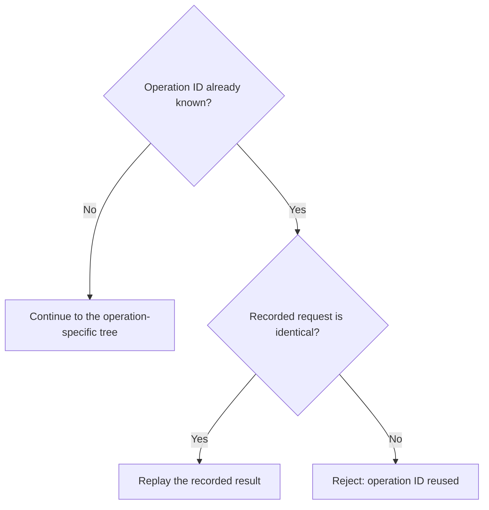
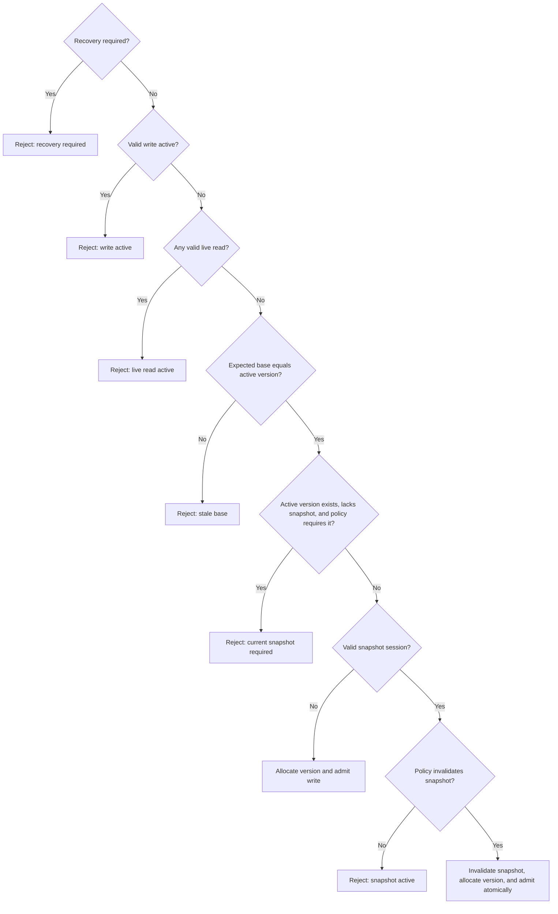
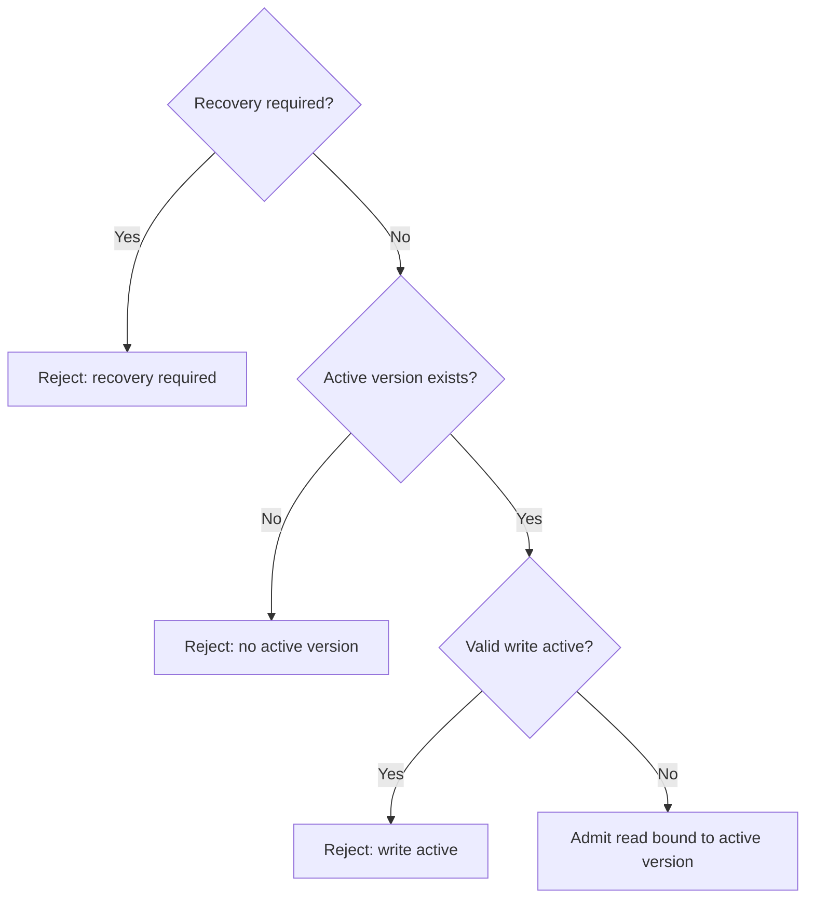
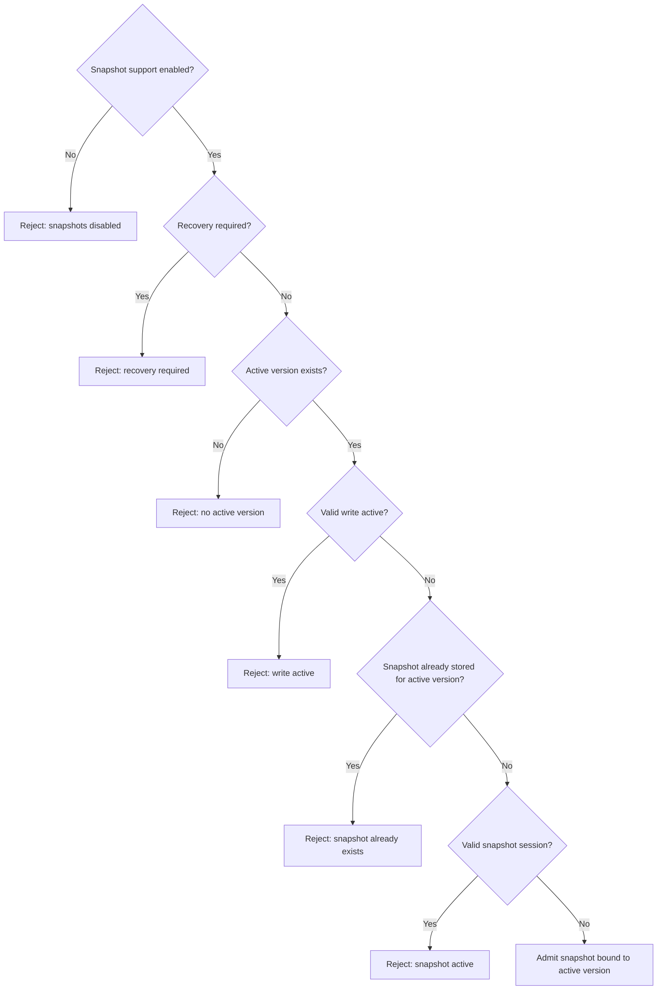
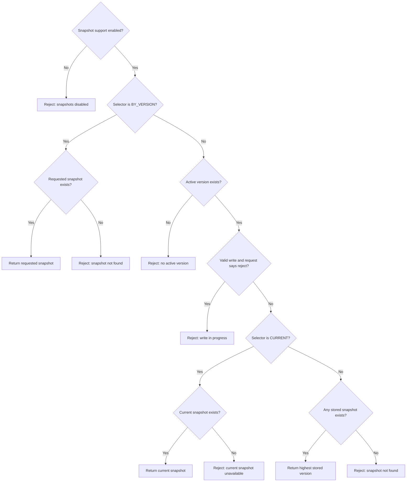

# Version Gate business rules

## 1. Status and purpose

This document is the normative, human-readable specification of the Version
Gate concurrency algorithm. It defines externally observable behavior and
safety rules. It does not define APIs, classes, configuration syntax, storage
topology, deployment, or payload encoding.

The algorithm is defined independently for each resource. Operations on two
different resources do not constrain one another.

The model separates five concerns:

1. coordinated mutation of live distributed data;
2. coordinated coherent reading of live distributed data;
3. generation of an immutable snapshot from stable live data;
4. retrieval of an already stored immutable snapshot; and
5. recovery after a write may have left live data in an uncertain state.

The first three concerns coordinate access to live data. Recovery exclusively
repairs or verifies live data. Stored snapshot retrieval reads only immutable
data and therefore does not join live-data coordination.

A TLA+ specification may formalize this document. The two representations must
describe the same state space, transitions, and safety properties. Any
difference is a specification defect that must be resolved explicitly.

## 2. Terms

- **Resource:** the independently coordinated unit. Every version, session,
  policy, and snapshot belongs to exactly one resource.
- **Active version:** the coordinator version of the last live-data state
  accepted as complete and coherent. It is absent before the first activation.
- **Allocated version:** a monotonically increasing coordinator version
  reserved for an accepted write. Allocation does not make it active.
- **Live read:** a read from distributed live data that requires a coherent
  view of one active version.
- **Snapshot generation:** external work that reads stable live data and
  constructs one complete immutable payload for its bound active version.
- **Stored snapshot read:** retrieval of an immutable payload already accepted
  by Version Gate. It never reads live data.
- **Session:** a leased coordination claim with a unique identity. It is
  *valid* only while open and unexpired. Completion, any abort, invalidation,
  expiry, and uncertain failure are terminal transitions.
- **Operation ID:** a caller-generated identity for one state-changing request,
  making it safe to repeat after a lost or delayed response.
- **Clean write abort:** termination of a write for which no externally visible
  mutation occurred, or rollback to the previously active version was
  verified.
- **Uncertain write:** a write that may have changed live data but did not
  complete, and for which a clean rollback cannot be proved.

## 3. Abstract state

For each resource, the state machine contains at least the following logical
state. These are specification variables, not storage requirements.

| State | Meaning |
| --- | --- |
| `policy` | The immutable resource policy described in [Policy](#6-policy). |
| `activeVersion` | The active version, or `NONE` before first activation. |
| `lastAllocatedVersion` | The greatest coordinator version ever allocated. |
| `lastFence` | The greatest write or recovery fencing token ever issued. |
| `time` | Monotonically non-decreasing coordinator logical time used for leases. |
| `writeSession` | Zero or one open write session. |
| `liveReadSessions` | The set of open live-read sessions. |
| `snapshotSession` | Zero or one open snapshot-generation session. |
| `snapshots` | A partial map from activated versions to immutable payloads. |
| `recovery` | Either `NONE` or a record containing the uncertain write version and the previously active version. |
| `recoverySession` | Zero or one open recovery session. |
| `sessionHistory` | The logically retained state of every terminal session. |
| `operationResults` | The logically retained request and result for every operation ID. |

Coordinator versions are positive integers; `lastAllocatedVersion` is initially
zero. The first evaluation of every accepted `beginWrite` allocates
`lastAllocatedVersion + 1`. A replay never allocates. Versions are ordered only
by this per-resource sequence. Client values, payloads, timestamps, arrival
times, and wall-clock order do not define version order.

A write session records its base version, candidate version, lease deadline,
and fence. A live-read or snapshot session records its bound version and lease
deadline. A recovery session records its lease deadline and fence.

Every state-changing action has one linearization point in the per-resource
state machine. Snapshot selection also observes `activeVersion`, the relevant
session state, and `snapshots` at one logical point so that returned metadata
describes the selected payload consistently.

Network delay, duplication, reordering, and lost responses do not split an
atomic transition. Coordinator failure is represented only when this abstract
state survives it. Loss or corruption of coordinator state is outside the
algorithm.

## 4. Responsibility boundary and participant assumptions

Version Gate coordinates only participants that follow this protocol. It
cannot prevent an unregistered process from reading or modifying live data.

Version Gate is responsible for:

- serializing admission and terminal transitions per resource;
- allocating coordinator versions;
- issuing leased sessions and monotonically increasing fencing tokens for
  write and recovery work;
- binding live reads and snapshot generation to the active version;
- applying the immutable resource policy atomically;
- publishing only complete immutable snapshots; and
- replaying recorded results for duplicate operation IDs.

Participants are responsible for:

- obtaining the required session before touching live data;
- using the session identity and, when issued, its fencing token when accessing
  protected components;
- stopping all activity under a session before requesting a successful terminal
  transition, and performing no new effect after any terminal transition or
  lease loss;
- never reporting a clean write abort unless its precondition is true;
- reporting an uncertain write when a clean abort cannot be proved; and
- deciding whether and when to retry a rejected request with a new operation
  ID.

A coordinator lease cannot physically stop a paused or partitioned process.
Therefore, the state-machine guarantees of non-overlap apply directly to
*valid sessions*. Actual live-data non-overlap additionally assumes that every
protected component atomically validates session validity and, where
applicable, the fencing token with each protected effect. Atomic validation
prevents a stale effect at its logical effect point. Physical non-overlap
across a long-running in-flight effect additionally requires the protected
component to drain or serialize that effect before installing conflicting
authority. Without these participant assumptions, a stale process is outside
the algorithm and can violate physical non-overlap.

Snapshot payloads are opaque to the concurrency algorithm. The algorithm
requires a complete logical payload and a stable equality relation, but does
not interpret, join, restore, or business-validate its contents.

Live-data contents are not part of the abstract state. The truth of write
completion, clean rollback, recovery verification, and snapshot derivation is
a participant assertion. A formal model of this algorithm proves coordination
safety conditional on those assertions; it does not prove the contents of
external data.

## 5. Fixed safety invariants

The following rules are not configurable:

1. At most one valid write session exists for a resource.
2. A valid write session never coexists with a valid live-read,
   snapshot-generation, or recovery session.
3. When recovery is required, no valid write, live-read, or snapshot-generation
   session exists. Stored snapshot reads remain allowed.
4. Multiple live-read sessions may coexist and may coexist with one
   snapshot-generation session.
5. At most one valid snapshot-generation session exists for a resource. It is
   bound to the active version observed when it begins.
6. A snapshot becomes visible only as one complete payload. No partial snapshot
   is visible.
7. A snapshot is stored only if its bound version remained active throughout
   its valid generation session and no valid write overlapped that session.
8. Stored snapshots are permanent and immutable in this model. For a completed
   snapshot session, re-submitting an equal payload is idempotent and submitting
   a different payload conflicts. Other terminal session outcomes take
   precedence over payload comparison.
9. Every stored snapshot version was once active and is never greater than the
   current `activeVersion`.
10. `activeVersion` changes only by successful write completion or recovery that
   accepts the uncertain write as complete.
11. Activation and release of the corresponding exclusive session are one
    atomic transition. There is no intermediate `READY` state.
12. Active versions, fencing tokens, and coordinator time never decrease.
    Allocated versions and fencing tokens are never reused. Versions belonging
    to cleanly aborted, uncertain, or expired writes remain gaps.
13. A write is admitted only when its expected base version equals the active
    version at admission.
14. A terminal session can never be revived. The first terminal transition in
    serialization order wins.
15. Repeating the same operation ID with the same request returns the originally
    recorded result and performs no new transition.
16. Resource policy never changes within this algorithm.
17. At most one valid recovery session exists, and it exists only while
    `recovery != NONE`.
18. A resource identity is never deleted, reused, or reset within this model.

## 6. Policy

### 6.1 Immutable resource policy

Policy is fixed when the resource enters the model. Runtime policy changes are
outside this algorithm.

#### Snapshot support

| Value | Rule |
| --- | --- |
| `DISABLED` | Snapshot generation and all stored-snapshot selectors are unavailable. Normal writes and live reads remain available. |
| `ENABLED` | Snapshot generation and all selectors are available subject to the remaining rules. |

Snapshots are optional. A resource may use Version Gate only for write and
live-read coordination.

#### Missing current snapshot when a writer arrives

| Value | Rule |
| --- | --- |
| `ALLOW_GAP` | The next write may begin even when no snapshot exists for the active version. |
| `REQUIRE_CURRENT_SNAPSHOT` | A write is rejected until a snapshot exists for the active version. |

This check applies only when `activeVersion` exists. It never prevents the
first write.

#### Writer arriving during snapshot generation

| Value | Rule |
| --- | --- |
| `BLOCK_WRITER` | Reject the writer and leave the snapshot session valid. |
| `INVALIDATE_SNAPSHOT` | Atomically invalidate the snapshot session and admit the writer, but only if every other write-admission condition succeeds. A late submission from the invalidated session is rejected. |

`INVALIDATE_SNAPSHOT` is compatible only with `ALLOW_GAP`. Combining it with
`REQUIRE_CURRENT_SNAPSHOT` is invalid because the missing-current check always
rejects the writer first, making snapshot invalidation unreachable and the two
configured intentions inconsistent.

#### Valid policy combinations

| Snapshot support | Missing-current policy | Writer-during-snapshot policy |
| --- | --- | --- |
| `DISABLED` | `ALLOW_GAP` | Not applicable |
| `ENABLED` | `ALLOW_GAP` | `BLOCK_WRITER` |
| `ENABLED` | `ALLOW_GAP` | `INVALIDATE_SNAPSHOT` |
| `ENABLED` | `REQUIRE_CURRENT_SNAPSHOT` | `BLOCK_WRITER` |

Every other combination is invalid.

### 6.2 Per-request choices

These values describe one request and do not change resource policy:

- `beginWrite` supplies `expectedBaseVersion`, including `NONE` before first
  activation;
- a stored snapshot read supplies `BY_VERSION(version)`, `CURRENT`, or
  `LATEST_AVAILABLE`; and
- a `CURRENT` or `LATEST_AVAILABLE` read supplies
  `ALLOW_WHILE_WRITING` or `REJECT_IF_WRITING`.

## 7. Operation identity and safe retry

Every state-changing request carries an operation ID unique within its
resource. Before evaluating current state, the state machine applies this
retry gate:

1. If the operation ID is unknown, evaluate the request and record both the
   request and its result.
2. If the operation ID is known and the request is identical, return the
   recorded result without re-evaluating admission or changing state.
3. If the operation ID is known but any operation name or parameter differs,
   reject operation-ID reuse.

Accepted and rejected results are both recorded. Consequently, retrying a
previously rejected attempt with the same operation ID returns the same
rejection. A genuinely new attempt uses a new operation ID.

Session-terminating requests also carry their own operation IDs and the session
identity. A lost `beginWrite` response therefore cannot allocate a second
version, and a lost completion response cannot complete twice.

The recorded request fingerprint includes the resource, operation kind,
parameters, referenced session, expected base version, and requested recovery
resolution, as applicable. Repeating a renewal ID returns the originally
recorded deadline; extending the lease again requires a new operation ID.

Replaying an earlier admission or renewal result never restores current
authority. The caller receives the original result, but the referenced session
may since have become terminal. A new operation ID that targets a terminal or
non-owned session changes no state and returns that session's terminal or stale
outcome.

This common ownership rule applies to every renewal, live-read completion,
write completion, clean abort, uncertainty report, snapshot submission,
snapshot abort, recovery resolution, and recovery abort: only the valid owning
session may perform the transition. The completed-snapshot equality rule in
[Snapshot-generation lifecycle](#15-snapshot-generation-lifecycle) is the sole
idempotent terminal-session exception.

Read-only stored snapshot retrieval does not need an operation ID because it
does not change state.

## 8. Leases, expiry, and fencing

Write, live-read, snapshot-generation, and recovery sessions are leased. A
session is valid exactly when it is open and the coordinator's logical time is
strictly before its lease deadline.

Client clocks do not determine validity.

Every admitted session receives a deadline strictly greater than `time`.
Successful renewal requires `newDeadline > oldDeadline` and replaces the old
deadline with that value.

`advanceTime(newTime)` is an internal state transition, not a caller request.
It requires `newTime >= time` and atomically:

1. sets `time = newTime`;
2. moves every open session whose deadline is at or before `newTime` to its
   terminal expired state; and
3. applies every operation-specific expiry consequence in the table below,
   including write expiry entering recovery in that same transition.

After `advanceTime`, no open session has a deadline at or before `time`. Before
a caller request is evaluated at the authoritative current time, due expiry is
materialized by this transition; only then does the operation-ID retry gate
run. Autonomous time advancement does not carry an operation ID.

`renewSession` is a state-changing, idempotent operation. It can extend only a
currently valid session. Renewal, completion, clean abort, invalidation,
uncertain failure, and expiry compete in the same per-resource serialization
order.

- Renewal that linearizes while the session is valid updates its deadline. It
  defeats expiry based on the old deadline but does not prevent a later
  terminal transition.
- If a terminal action linearizes while the session is valid, it makes the
  session irreversible.
- At or after the lease deadline, expiry wins before a new action is evaluated.
- An expired, invalidated, completed, or aborted session cannot be renewed or
  revived.

Expiry has operation-specific consequences:

| Expired session | Consequence |
| --- | --- |
| Live read | Release its coordination claim. A later writer may be admitted. |
| Snapshot generation | Store nothing and make the attempt terminal. A new attempt may later be admitted. |
| Write | Enter `RECOVERY_REQUIRED`, because visible partial mutation cannot be excluded. |
| Recovery | End only that recovery attempt; the resource remains `RECOVERY_REQUIRED`. |

Write and recovery sessions carry monotonically increasing fencing tokens.
Session identity and fencing remain terminally known. A new request targeting a
terminal session receives that terminal outcome rather than being mistaken for
a new owner; replaying an old operation ID still returns that operation's
recorded result.

## 9. Bootstrap

The initial resource state is:

- `activeVersion = NONE`;
- `lastAllocatedVersion = 0`, `lastFence = 0`, and `time = 0`;
- no sessions, snapshots, or recovery record; and
- the immutable resource policy already fixed.

While the resource remains in its initial normal state with no valid session:

- `beginWrite(expectedBaseVersion = NONE)` may be admitted;
- `beginLiveRead` rejects because no coherent active version exists;
- when snapshot support is enabled, `beginSnapshot`, `CURRENT`, and
  `LATEST_AVAILABLE` reject with `NO_ACTIVE_VERSION`, while
  `BY_VERSION(version)` returns snapshot not found; and
- when snapshot support is disabled, every snapshot operation rejects with
  snapshot support disabled.

If an uncertain first write places the resource in recovery while
`activeVersion` is still `NONE`, recovery-required precedence applies instead.

There is no separate adoption or initialization transition. Pre-existing data
must enter the model through the normal first fenced write. Completing that
write declares its resulting live data coherent and creates the first active
version. A separate import protocol would be a state-machine extension.

## 10. Business operations

The names below identify state-machine actions, not transport or language-level
API names.

| Operation | State-machine role |
| --- | --- |
| `beginWrite` | Validate the expected base, allocate a version, and create an exclusive leased write session. |
| `completeWrite` | Atomically activate the write's version and terminate the session successfully. |
| `abortWriteClean` | Terminate a provably non-mutating or verified-rolled-back write without activation. |
| `reportWriteUncertain` | Terminate an uncertain write and place the resource in recovery. |
| `beginLiveRead` | Create a leased live-read session bound to the active version. |
| `completeLiveRead` | Terminate one live-read session. |
| `beginSnapshot` | Create a leased snapshot-generation session bound to the active version. |
| `submitSnapshot` | Atomically publish one complete immutable payload for the bound version. |
| `abortSnapshot` | Terminate one generation attempt without publishing a snapshot. |
| `renewSession` | Extend a still-valid write, live-read, snapshot, or recovery session. |
| `advanceTime` | Internally advance coordinator time and atomically expire every newly due session. |
| `beginRecovery` | Create an exclusive leased, fenced recovery session. |
| `resolveRecovery` | Verify a coherent resolution, optionally activate the uncertain write version, and leave recovery atomically. |
| `abortRecovery` | End one recovery attempt while leaving the resource in recovery. |
| `getSnapshot` | Resolve a stored snapshot selector without joining live-data coordination. |

Every admission operation is fail-fast. The state machine does not queue, wait,
or retry for a caller.

## 11. Admission decision trees

The trees assume that `advanceTime` has first materialized every due expiry and
that the retry gate in [Operation identity and safe
retry](#7-operation-identity-and-safe-retry) has then accepted a new operation
ID.

### 11.1 Shared retry gate

### 11.2 New write

The live-read check precedes snapshot invalidation. A writer can never
invalidate a snapshot and then discover that a live reader prevents admission.
All other admission checks also precede invalidation; invalidation and writer
admission form one indivisible transition.

### 11.3 New live read

Other live reads and one snapshot-generation session may coexist with the new
read.

### 11.4 New snapshot generation

Valid live reads do not block snapshot generation because both operations read
the same stable live version.

### 11.5 Stored snapshot retrieval

Recovery is intentionally absent from this tree. It blocks access to uncertain
live data, not access to immutable stored snapshots.

## 12. Write lifecycle

### 12.1 Admission

`beginWrite(operationId, expectedBaseVersion)` compares the expected base with
`activeVersion` at its linearization point. A stale intent is rejected even if
the caller observed or computed against an older state before admission.

On success, one atomic transition:

1. invalidates the valid snapshot session when the policy requires it;
2. allocates `lastAllocatedVersion + 1`;
3. creates a valid leased write session bound to both the expected base and the
   allocated version; and
4. issues fencing token `lastFence + 1` and updates `lastFence`.

`activeVersion` remains unchanged while the write is open.

### 12.2 Successful completion

Calling `completeWrite` asserts that every intended live-data change is
complete and coherent for the allocated version, no partial work remains, and
the participant will perform no further effect under that session. If this
cannot be asserted, only `reportWriteUncertain` is legal.

`completeWrite` succeeds only for the valid owning session. It atomically makes
the allocated version active and terminates the write session. Readers can
never observe a separate completed-but-not-active state.

### 12.3 Clean abort versus uncertainty

`abortWriteClean` leaves `activeVersion` unchanged and permanently leaves the
allocated version unused. It is valid only when no externally visible mutation
occurred or rollback to the previously active version was verified, and only
the valid owning session may perform it.

If that condition cannot be proved, the caller must use
`reportWriteUncertain`. Write lease expiry has the same conservative meaning.
`reportWriteUncertain` also requires the valid owning session. It and write
lease expiry both terminate the write session and enter `RECOVERY_REQUIRED`.

A generic “failed write” transition is deliberately absent because failure
alone does not say whether live data remained coherent.

## 13. Recovery lifecycle

Entering recovery records:

- the uncertain write's allocated version; and
- the previously active version, which may be `NONE` for the first write.

While recovery is required:

- normal writes, live reads, and snapshot generation reject;
- stored snapshot retrieval remains available; and
- at most one valid recovery session may exist.

`beginRecovery` creates an exclusive leased session with fencing token
`lastFence + 1` and updates `lastFence`. Recovery work is the only live-data
activity permitted in this state. It rejects when recovery is not required or
another valid recovery session exists.

When the previously active version is `NONE`, the *pre-activation baseline*
means that every effect of the uncertain first write has been undone or made
inaccessible, no data is exposed as an active version, and a new first fenced
write can safely begin. The algorithm does not otherwise prescribe the
contents of that baseline.

`resolveRecovery` has exactly two successful resolutions:

| Resolution | Required fact | Atomic state transition |
| --- | --- | --- |
| `RESTORE_PREVIOUS` | Live data is verified coherent for the previously active version, or satisfies the pre-activation baseline when it was `NONE`. | Leave `activeVersion` unchanged, permanently abandon the uncertain version, terminate the recovery session, and clear recovery. |
| `ACCEPT_WRITE_VERSION` | Live data is verified complete and coherent for the uncertain write's allocated version. | Make that version active, terminate the recovery session, and clear recovery. |

Resolution succeeds only for the valid owning recovery session. The algorithm
treats an authorized resolution as an assertion that the required fact has
been verified, all recovery effects are complete, and no further effect will
occur under that session. It does not interpret live data itself.

Recovery does not revive the expired or uncertain write session. It resolves
the resource through a separate, more strongly fenced session.

`abortRecovery` and recovery lease expiry terminate only the current recovery
attempt. The recovery record remains, and a later `beginRecovery` may create a
new, more strongly fenced attempt.

## 14. Live-read lifecycle

`beginLiveRead` creates a leased session bound to the active version observed at
admission. Several live reads may coexist. A snapshot-generation session may
also coexist because neither operation mutates live data.

`completeLiveRead` may be called only after all live-data access under that
session has ended. It succeeds only for the valid owning session and removes
that reader's coordination claim. Authoritative lease expiry also removes the
claim. The state machine does not distinguish a successful read from an
aborted read because both have the same non-mutating release transition. A
stale physical reader must then be stopped by the participant guard described
in [Responsibility boundary and participant
assumptions](#4-responsibility-boundary-and-participant-assumptions).

## 15. Snapshot-generation lifecycle

`beginSnapshot` binds the provider to the current active version; the provider
does not choose or submit a version later.

Snapshot submission applies this precedence:

1. operation-ID replay or reuse mismatch;
2. session ownership and terminal state; and
3. for a completed session, equality with its stored payload.

An aborted, expired, or invalidated session therefore returns its terminal
outcome without comparing payloads. For a completed session, an equal payload
returns the completed result and a different payload returns snapshot payload
conflict. With the same operation ID but changed payload, operation-ID reuse
wins before payload comparison.

`submitSnapshot` succeeds only when:

- the session is valid and owns the submission;
- the session has not been invalidated or otherwise terminated;
- its bound version is still active; and
- no immutable snapshot already exists for that version.

Calling it asserts that all live-data access under the session has ended and
that the complete payload was derived from the session's bound version.

Successful submission atomically publishes one complete payload and terminates
the session. Payload construction may occur externally, but the state machine
never exposes a partial result.

Only one *valid* snapshot-generation session may exist at a time. A new session
for the same version may be admitted after abort, expiry, or invalidation when
all of the following remain true:

- that version is still active;
- no snapshot is stored for it;
- no write or recovery blocks admission; and
- snapshot support is enabled.

Thus, invalidation does not permanently forbid retry. For example, if the
writer that invalidated a snapshot later aborts cleanly, or recovery restores
the previous version, the still-active old version may be snapshotted by a new
session. If the writer completes, the old version is no longer eligible because
snapshot generation always targets the current active version.

Snapshot finalization and writer admission are serialized:

- if finalization linearizes first, the snapshot exists before the writer is
  evaluated; or
- if `INVALIDATE_SNAPSHOT` and writer admission linearize first, the session is
  terminally invalidated and later finalization fails.

There is no state in which both transitions succeed for the same session.

## 16. Stored snapshot retrieval

Stored snapshot retrieval never acquires a live-read session and never blocks
another operation. All selectors require snapshot support to be enabled.

### 16.1 Selectors

| Selector | Result |
| --- | --- |
| `BY_VERSION(version)` | Return that immutable snapshot if it exists; otherwise return snapshot not found. |
| `CURRENT` | Return the snapshot whose version equals `activeVersion`; return current snapshot unavailable when that snapshot is missing. |
| `LATEST_AVAILABLE` | Return the snapshot with the greatest stored coordinator version, even when it is older than `activeVersion`. |

`CURRENT` and `LATEST_AVAILABLE` reject with `NO_ACTIVE_VERSION` before first
activation. `BY_VERSION` remains a direct map lookup and ignores live
coordination state.

Every successful response identifies at least:

- `snapshotVersion`;
- the `activeVersion` observed during selection; and
- whether the resource was in normal or recovery-required state.

A `LATEST_AVAILABLE` result is explicitly stale when
`snapshotVersion < activeVersion`. An older stored snapshot is never presented
as current.

### 16.2 Request policy during a write

For `CURRENT` and `LATEST_AVAILABLE`, each request chooses:

| Value | Rule while a valid write exists |
| --- | --- |
| `ALLOW_WHILE_WRITING` | Resolve against the previously active version, which remains active until successful completion. |
| `REJECT_IF_WRITING` | Reject with write in progress. The caller decides whether and when to try again. |

Within a snapshot-enabled resource, `BY_VERSION` ignores this choice and
remains available. Recovery also does not block stored snapshot retrieval
because the immutable payload is independent of uncertain live data.

### 16.3 Example

Assume active version 9, write 10 in progress, and stored snapshots 7 and 8:

| Request | Result |
| --- | --- |
| `BY_VERSION(8)` | Snapshot 8. |
| `LATEST_AVAILABLE + ALLOW_WHILE_WRITING` | Snapshot 8, with active version 9 and stale status. |
| `LATEST_AVAILABLE + REJECT_IF_WRITING` | Write-in-progress rejection. |
| `CURRENT + ALLOW_WHILE_WRITING` | Current-snapshot-unavailable rejection because snapshot 9 is absent. |
| `CURRENT + REJECT_IF_WRITING` | Write-in-progress rejection. |

## 17. Compatibility summary

Expired sessions are terminal and do not appear in this table.

| Current valid state | New write | New live read | New snapshot generation | Stored snapshot read |
| --- | --- | --- | --- | --- |
| Normal, no live session | Apply expected-base and snapshot policies | Allow if an active version exists | Allow if its preconditions hold | Resolve the selector |
| Write | Reject | Reject | Reject | When snapshot support is enabled, `BY_VERSION` is allowed; `CURRENT`/`LATEST_AVAILABLE` use the request's during-write choice |
| Live read(s) | Reject | Allow | Allow if its other preconditions hold | Resolve the selector |
| Snapshot generation | Apply the complete write-admission tree; missing-current policy precedes writer-during-snapshot policy | Allow | Reject | Resolve the selector |
| Live read(s) plus snapshot generation | Reject because a live read has precedence | Allow | Reject | Resolve the selector |
| `RECOVERY_REQUIRED`, with or without a recovery session | Reject | Reject | Reject | Resolve the selector and report recovery-required state |

## 18. Deterministic ordering and races

Concurrent actions do not produce a third outcome; one action linearizes first
for the resource.

- **Retry versus changed state:** after due expiry is materialized, a known
  operation ID returns its recorded result before current admission conditions
  are considered.
- **Lease deadline versus action:** an action that linearizes while the lease is
  valid may win; at or after the deadline, expiry wins first.
- **Completion versus abort or uncertainty:** the first terminal transition
  wins. Later terminal requests return the recorded terminal state.
- **Reader versus writer admission:** if the reader is admitted first, the
  writer rejects; if the writer is admitted first, the reader rejects.
- **Snapshot versus writer admission:** if the snapshot session is admitted
  first, the writer follows the configured block-or-invalidate rule; if the
  writer is admitted first, snapshot admission rejects.
- **Snapshot finalization versus invalidating writer:** finalization-first stores
  the snapshot; writer-first invalidates the session and prevents storage.

For a new `beginWrite`, rejection precedence is:

1. recovery required;
2. another valid write;
3. one or more valid live reads;
4. expected-base mismatch;
5. a missing required current snapshot; and
6. a valid snapshot session protected by `BLOCK_WRITER`.

Snapshot invalidation occurs only after every rejecting condition has been
excluded.

## 19. Conceptual outcomes

Public names and transport representations are outside this specification, but
callers must be able to distinguish at least these semantic outcomes:

| Outcome | Meaning |
| --- | --- |
| Operation ID reused | A known operation ID was supplied with a different request. |
| No active version | The resource has not yet completed its first successful write. |
| Expected base mismatch | The write intent was based on a version other than the active version at admission. |
| Write active | Another valid writer owns the resource. |
| Live read active | One or more valid live readers block a writer. |
| Snapshot generation active | Policy gives the current generation session priority over a writer, or another snapshot attempt is active. |
| Current snapshot required | Resource policy forbids the next write until the active version has a snapshot. |
| Snapshot support disabled | The requested snapshot capability is not enabled. |
| Snapshot already exists | The active version already has its immutable snapshot. |
| Snapshot payload conflict | A completed snapshot session was re-submitted with a different payload. |
| Snapshot invalidated | A writer won the configured conflict and the session can never publish. |
| Snapshot not found | No stored snapshot exists for the explicit or latest-available selection. |
| Current snapshot unavailable | An active version exists but its snapshot does not. |
| Write in progress | Request policy rejects `CURRENT` or `LATEST_AVAILABLE` selection during a write. |
| Recovery required | Live data may be uncertain and normal live-data operations are quarantined. |
| Session expired or stale | The caller no longer owns a valid coordination claim. |
| Session already terminal | Another terminal transition won the serialization order. |

## 20. Liveness and fairness

This algorithm specifies safety, not eventual admission.

- Every conflicting request fails fast; there is no server-side queue or wait.
- Continuous live readers may repeatedly cause writers to be rejected.
- Continuous accepted writes may repeatedly prevent snapshot generation.
- When coordinator time advances, abandoned live-read and snapshot claims
  expire. An expired write releases its session but deliberately quarantines
  the resource until recovery; normal operations may therefore remain blocked
  indefinitely.
- No lease guarantees that any particular retry will be admitted.

Retry timing, backoff, prioritization, and fairness belong to callers or to a
separate scheduling extension. They must not weaken the safety invariants in
this document.

## 21. Deliberate exclusions

The following concerns are outside this algorithm:

- snapshot deletion or retention; snapshots and their identities are permanent
  here;
- runtime mutation of resource policy;
- resource deletion, identity reuse, or state reset;
- authorization and administrative approval;
- endpoint, Java, configuration-file, and error-code syntax;
- storage engines, storage topology, replication, and deployment;
- payload format, component layout, transport, and upload mechanics; and
- automatic callbacks, server-side waiting, queues, or retries; and
- adoption of pre-existing data without the normal first fenced write.

Adding retention or dynamic policy later changes the state machine and requires
an explicit revision of both this document and its TLA+ formalization.
